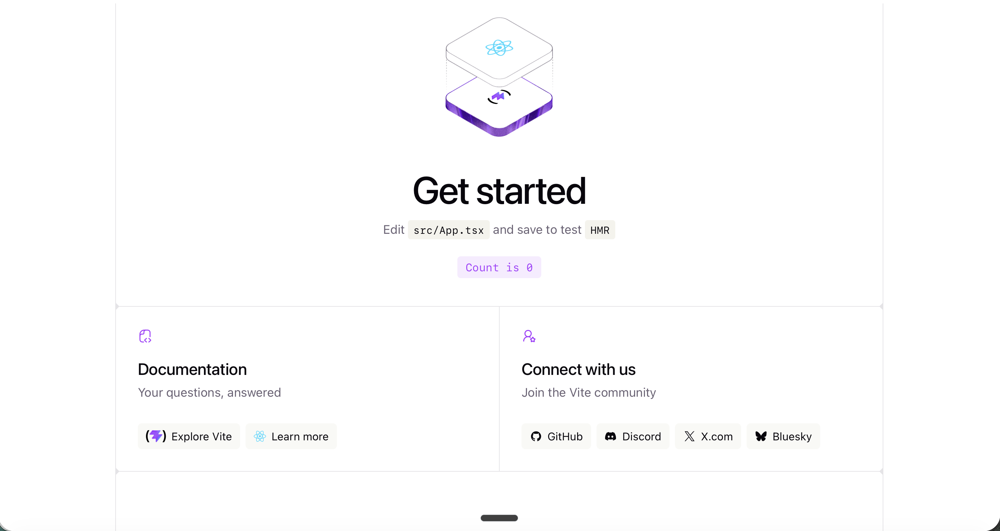
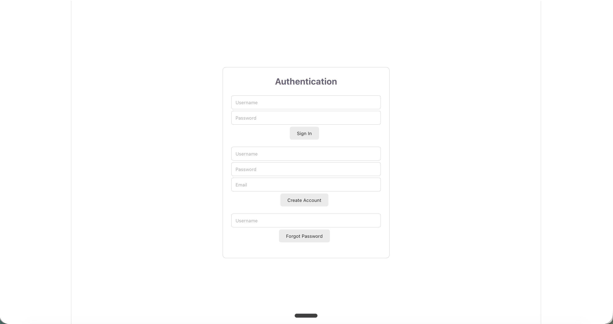
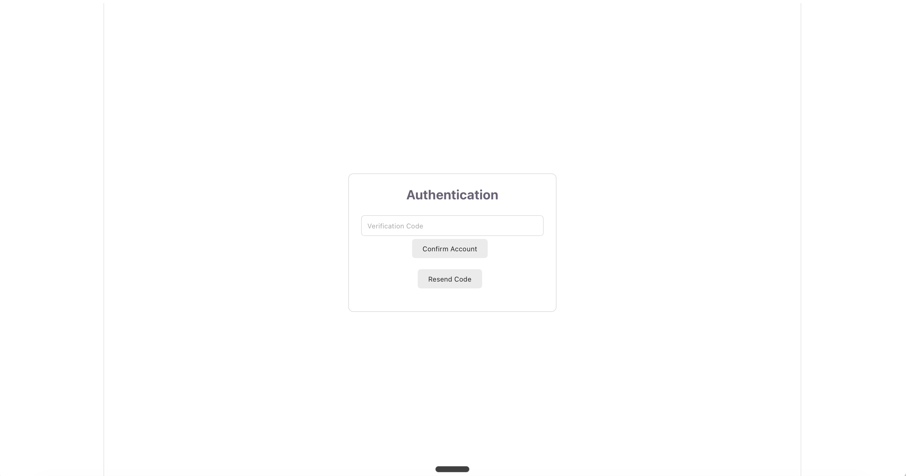
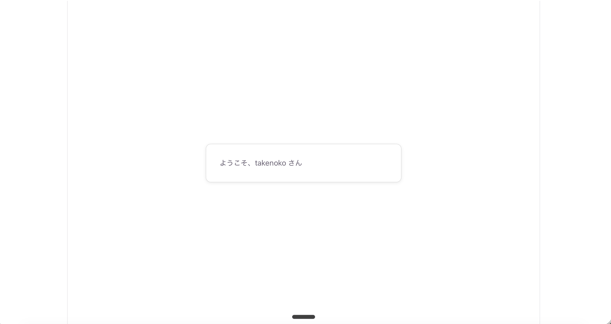
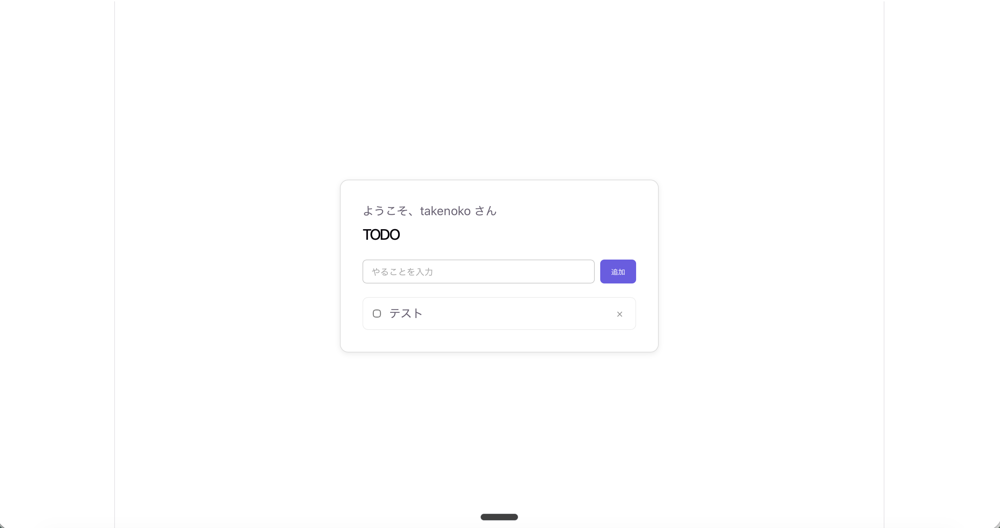

# TODOアプリ作成 by AWS Blocks

## セットアップ

**作業目安：15分**

### プロジェクトの作成（準備済み）

本ワークショップで使用するプロジェクトのセットアップは、テンプレートリポジトリの`todo-app/`にすでに済んでいます。

<details>
<summary>実行済みのセットアップコマンド</summary>

下記コマンドがすでに実行されています。本ワークショップでは実行しなくて大丈夫です。

```shell
# vite - react のセットアップ
npm create vite@latest todo-app -- --template react-ts

# amplify のセットアップ
cd todo-app
npm create amplify@latest -- --template react-vite

# Blocksの追加（amplify/backend.tsが検出され、amplifyテンプレートが自動選択される）
npx @aws-blocks/create-blocks-app .
```

</details>

<br>

以下のフォルダがあることを確認してください。

| ディレクトリ | 内容 |
|---|---|
| `todo-app/src` | フロントエンドコード |
| `todo-app/amplify` | Amplifyのバックエンドコード |
| `todo-app/aws-blocks` | Blocksのバックエンドコード |

### 依存関係のインストール

TODOアプリ作成に必要なJavaScriptライブラリをインストールします。

1. `todo-app`フォルダ内で`npm install`を実行します。

```shell
cd todo-app
npm install
```

### ローカルサーバーの起動

AWS Blocksにはローカル完結の開発サーバーがあるため、まずはローカルで開発していきます。

1. AWS Blocksをローカルで起動します。
`http://localhost:3001`でAWS BlocksのAPIサーバーが起動します。

```shell
npm run blocks:dev
```

2. 続けて、新しいターミナルを起動して、Viteの開発サーバーも起動します。

```shell
# 新しいターミナルを起動
cd todo-app
npm run dev
```

3. ブラウザから`http://localhost:5173/` を開くと、Viteの初期画面が表示されれば完了です。



## ログイン画面の実装

**作業目安：15分**

### AWS Blocksに認証機能を追加する

AWS Blocksの`AuthCognito`で認証機能を作ります。

1. `todo-app/aws-blocks/index.ts`の`import`文に`Scope`と`AuthCognito`を追加します。
`AuthCognito`は、Amazon Cognitoの User Poolベースの認証です。

```typescript title="aws-blocks/index.ts"
import { Scope, AuthCognito } from '@aws-blocks/blocks';
```

2. 認証(`AuthCognito`)を追加します。

```typescript title="aws-blocks/index.ts(追記)"
const scope = new Scope('a');

const auth = new AuthCognito(scope, 'auth', {
  passwordPolicy: {
    minLength: 8,
    requireDigits: true
  },
  crossDomain: true,
});

export const authApi = auth.createApi();
```

> **passwordPolicyについて**
> `passwordPolicy`ではパスワードの要件を指定できます。
> - `minLength: 8`: 最小文字数を8文字にする
> - `requireDigits: true`: 数字を必須にする

> **crossDomainについて**
> フロントエンドとAPIが別ドメインになる環境（Codespaces・AWSへのデプロイ後）でも、ログイン状態を保つための設定です。

これでAWS Blocks側に認証機能を追加できました。

### フロントエンドに認証画面を追加する

1. `todo-app/src/App.tsx`の`import`文を以下のように書き換えます。

```tsx title="src/App.tsx"
import { useEffect, useRef, useState } from 'react'
import { authApi } from 'aws-blocks'
import { Authenticator, onAuthChange } from '@aws-blocks/blocks/ui'
import './App.css'
```

2. `todo-app/src/App.tsx`に`Authenticator`を組み込みます。

```tsx title="src/App.tsx(追記)"
// importはそのまま

function App() {
  const authRef = useRef<HTMLDivElement>(null)
  const mounted = useRef(false)

  // Authenticator()は複数回呼べないため、初回のみ実行する
  useEffect(() => {
    if (mounted.current || !authRef.current) {
      return
    }
    mounted.current = true
    authRef.current.appendChild(Authenticator(authApi))
  }, [])

  return <div ref={authRef} className="app-layout" />
}

export default App
```

3. `todo-app/src/App.tsx`に、ログイン済みならTodo画面を表示する処理を組み込みます。

```tsx title="src/App.tsx(追記)"
// importはそのまま

function App() {
  const authRef = useRef<HTMLDivElement>(null)
  const mounted = useRef(false)

  const [user, setUser] = useState<{ userId: string; username: string } | null>(null)

  // Authenticator()は複数回呼べないため、初回のみ実行する
  useEffect(() => {
    if (mounted.current || !authRef.current) {
      return
    }
    mounted.current = true
    authRef.current.appendChild(Authenticator(authApi))
  }, [])

  // ログイン状態を監視する
  useEffect(() => onAuthChange(authApi, setUser), [])

  if (!user) {
    return <div ref={authRef} className="app-layout" key="auth" />
  }

  return (
    <div className="app-layout" key="app">
      <section id="todo">
        <p>ようこそ、{user.username} さん</p>
        {/* Todo一覧はここに続く */}
      </section>
    </div>
  )
}

export default App
```

> **ログインすると自動でsetUserが呼ばれる**
> ログイン状態が変わるたびに、AWS Blocks側が自動で`setUser`を呼び出してくれます。
> `user`の値をチェックして、画面が切り替わります。


4. ブラウザを再読み込みすると、サインアップ・サインイン画面が表示されます。


5. 中央の欄にメールアドレスとパスワードを入力し、「Create Account」を押します。

6. `todo-app/.bb-data/app-auth/last-code.json`に記載された検証コード(6桁の数値)を画面に入力し、「Confirm Account」を押します。


> **last-code.jsonのイメージ**
> ```json
> {
>   "username": "takenoko",
>   "code": "570138",
>   "purpose": "signUp"
> }
> ```

7. これでサインアップができました。


## Todo機能の実装

**作業目安：15分**

### AWS Blocksにデータベースを追加する

Todoデータは、AWS Blocksの`DistributedTable`で自前のテーブルとして持ちます。
`DistributedTable`は、Amazon DynamoDBベースのデータベースです。
AuthCognito同様にローカル上で動作します。

1. `todo-app/aws-blocks/index.ts`の`import`文に`DistributedTable`を追加します。
`z`のimportも追加します。

```typescript title="aws-blocks/index.ts(追記)"
import { Scope, AuthCognito, DistributedTable } from '@aws-blocks/blocks';
import { z } from 'zod';
```

2. Todoテーブルを追加します。

```typescript title="aws-blocks/index.ts(追記)"
// scope・authの宣言はそのまま

const todoSchema = z.object({
  id: z.string(),
  text: z.string(),
  done: z.boolean(),
  owner: z.string(),
});

const todos = new DistributedTable(scope, 'todos', {
  schema: todoSchema,
  key: { partitionKey: 'owner', sortKey: 'id' },
});
```

### AWS BlocksにTODOを操作するAPIを追加する

1. `todo-app/aws-blocks/index.ts`の`import`文に`ApiNamespace`を追加します。

```typescript title="aws-blocks/index.ts(追記)"
import { Scope, AuthCognito, DistributedTable, ApiNamespace } from '@aws-blocks/blocks';
import { z } from 'zod';
```

2. Todoを操作するAPIを追加します。

```typescript title="aws-blocks/index.ts(追記)"
// scope・auth・todoSchema・todosの宣言はそのまま

export const api = new ApiNamespace(scope, 'api', (context) => ({
  // 自分のTodoを一覧取得する
  async listTodos() {
    const user = await auth.requireAuth(context);
    const results = [];
    for await (const todo of todos.query({ where: { owner: { equals: user.username } } })) {
      results.push(todo);
    }
    return results;
  },
  // Todoを新しく追加する
  async createTodo(text: string) {
    const user = await auth.requireAuth(context);
    const id = `todo-${Date.now().toString(36)}`;
    const todo = { id, text, done: false, owner: user.username };
    await todos.put(todo);
    return todo;
  },
  // Todoの完了/未完了を切り替える
  async toggleTodo(id: string, done: boolean) {
    const user = await auth.requireAuth(context);
    const owner = user.username;
    const todo = await todos.get({ owner, id });
    if (!todo) {
      throw new Error('not found');
    }
    const updatedTodo = { ...todo, done };
    await todos.put(updatedTodo);
  },
  // Todoを削除する
  async deleteTodo(id: string) {
    const user = await auth.requireAuth(context);
    await todos.delete({ owner: user.username, id });
  },
}));
```

3. `todo-app/src/App.tsx`を、前節のログイン画面とTodo一覧を組み合わせた完全な形に書き換えます。
(App.tsxのコードが長くなったので折り畳んでいます)

<details>
<summary>todo-app/src/App.tsx(全文)</summary>

```tsx
import { useEffect, useRef, useState } from 'react'
import { api, authApi } from 'aws-blocks'
import { Authenticator, onAuthChange } from '@aws-blocks/blocks/ui'
import './App.css'

type Todo = { id: string; text: string; done: boolean; owner: string }
type User = { userId: string; username: string }

function TodoSection({ user }: { user: User }) {
  const [todos, setTodos] = useState<Todo[]>([])
  const [text, setText] = useState('')

  const refresh = async () => setTodos(await api.listTodos())

  useEffect(() => { refresh() }, [])

  async function addTodo() {
    if (text.trim() === '') {
      return
    }
    await api.createTodo(text)
    setText('')
    await refresh()
  }

  async function toggleTodo(todo: Todo) {
    await api.toggleTodo(todo.id, !todo.done)
    await refresh()
  }

  async function deleteTodo(id: string) {
    await api.deleteTodo(id)
    await refresh()
  }

  return (
    <section id="todo">
      <p>ようこそ、{user.username} さん</p>
      <h1>TODO</h1>
      <div className="todo-form">
        <input value={text} onChange={(e) => setText(e.target.value)} placeholder="やることを入力" />
        <button onClick={addTodo}>追加</button>
      </div>
      <ul className="todo-list">
        {todos.map((todo) => (
          <li key={todo.id} className={todo.done ? 'done' : ''}>
            <input type="checkbox" checked={todo.done} onChange={() => toggleTodo(todo)} />
            <span>{todo.text}</span>
            <button className="delete" onClick={() => deleteTodo(todo.id)}>×</button>
          </li>
        ))}
      </ul>
    </section>
  )
}

function App() {
  const authRef = useRef<HTMLDivElement>(null)
  const mounted = useRef(false)
  const [user, setUser] = useState<User | null>(null)

  // Authenticator()は複数回呼べないため、初回のみ実行する
  useEffect(() => {
    if (mounted.current || !authRef.current) {
      return
    }
    mounted.current = true
    authRef.current.appendChild(Authenticator(authApi))
  }, [])

  // ログイン状態の変化を監視する
  useEffect(() => onAuthChange(authApi, setUser), [])

  if (!user) {
    return <div ref={authRef} className="app-layout" key="auth" />
  }

  return (
    <div className="app-layout" key="app">
      <TodoSection user={user} />
    </div>
  )
}

export default App
```

</details>

<br>

6. 実際にアプリを使用して、Todoの追加・完了・削除ができることを確認しましょう。



問題なければ、ここまでの成果をコミットしておきましょう。

ここまで確認できたら、次のステップ（[docs/3_AIアシスタント追加 by AWS Blocks.md](3_AIアシスタント追加%20by%20AWS%20Blocks.md)）に進んでください。

> **データの保存先**
> データは`.bb-data/`ディレクトリにファイルとして保存されます（削除すればリセットできます）。
