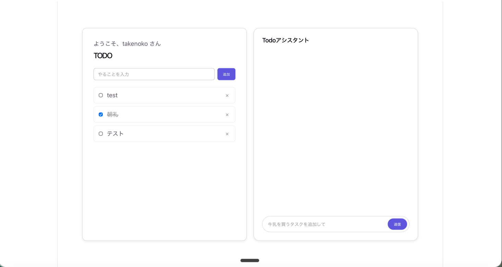

# AIアシスタント追加 by AWS Blocks

前章で作ったTodoアプリに、AWS Blocksの`Agent`を使ってAIアシスタント機能を追加します。

## Agentの追加

本ワークショップでは、Bedrock APIキーを使い、実際にBedrockと通信します。
APIキーは当日、Google Docsで共有します。

**作業目安：15分**

1. Bedrock APIキーを環境変数として渡します。起動中の`npm run blocks:dev`を`Ctrl+C`で止め、以下を実行してください。

```shell
export AWS_BEARER_TOKEN_BEDROCK=<当日配布するBedrock APIキー>
export AWS_REGION=ap-northeast-1
npm run blocks:dev
```

2. `todo-app/aws-blocks/index.ts`の`import`文に`Agent`・`BedrockModels`を追加します。

```typescript title="aws-blocks/index.ts(追記)"
import { Scope, AuthCognito, DistributedTable, ApiNamespace, Agent, BedrockModels } from '@aws-blocks/blocks';
import { z } from 'zod';
```

3. `todo-app/aws-blocks/index.ts`にAgentを追加します。

```typescript title="aws-blocks/index.ts(追記)"
// import・scope・auth・todoSchema・todosの宣言はそのまま

const agent = new Agent(scope, 'ai', {
  model: {
    deployed: BedrockModels.BALANCED,
    local: { provider: 'bedrock', modelId: 'moonshotai.kimi-k2.5' },
  },
  streamingMode: 'token',
  systemPrompt: 'あなたはTodoアプリのアシスタントです。ユーザーの指示に応じてTodoを追加・完了します。',
  toolContextSchema: z.object({ owner: z.string() }),
  tools: (tool) => ({
    // 後ほどツールはここに追加していきます
  }),
});
```

> **localの設定について**
> `local`には、手順1で設定した`AWS_BEARER_TOKEN_BEDROCK`を使ってBedrockを呼び出す設定を入れています。

> **OllamaなどローカルLLMを使う場合**
> <details>
> <summary>ローカルLLM(Ollama)を使う場合</summary>
>
> ネットワーク不要ですが、目安メモリ8GB以上が必要で、事前にOllamaのインストールとモデルのpullが必要です（Ollamaは事前にインストール・モデルのpullを済ませておけば、当日ネットワークが無くても動作します）。
>
> ```shell
> sudo apt-get update && sudo apt-get install -y zstd
> curl -fsSL https://ollama.com/install.sh | sh
> ```
>
> コンテナ環境では`ollama serve`が自動起動しないことがあるため、新しいターミナルを起動して起動しておきます。
>
> ```shell
> # 新しいターミナルを起動
> ollama serve
> ```
>
> 元のターミナルで、モデルをpullします。
>
> ```shell
> ollama pull llama3.1:8b
> ```
>
> Codespacesを使わず、手元のWindows PCに直接cloneして作業している場合は、[ollama.com/download](https://ollama.com/download)からインストーラー(`OllamaSetup.exe`)をダウンロードして実行してください。インストール後、コマンドプロンプトかPowerShellで`ollama pull llama3.1:8b`を実行します。
>
> `import`文に`OllamaModels`を追加し、`local`は`OllamaModels.SMALL`を指定します。
>
> </details>

4. `addTodo`ツール（Todoを新しく追加する）を実装します。

```typescript title="aws-blocks/index.ts(抜粋)"
const agent = new Agent(scope, 'ai', {
  // model・systemPrompt・toolContextSchemaの宣言はそのまま
  tools: (tool) => ({
    addTodo: tool({
      description: 'Todoを新しく追加する',
      parameters: z.object({ text: z.string().describe('Todoの内容') }),
      handler: async ({ input, context }) => {
        const id = `todo-${Date.now().toString(36)}`;
        const todo = { id, text: input.text, done: false, owner: context.owner };
        await todos.put(todo);
        return todo;
      },
    }),
  }),
});
```

5. `toggleTodo`ツール（テキストが一致するTodoを完了/未完了にする）を実装します。

```typescript title="aws-blocks/index.ts(抜粋)"
const agent = new Agent(scope, 'ai', {
  // model・systemPrompt・toolContextSchemaの宣言はそのまま
  tools: (tool) => ({
    // addTodoの宣言はそのまま
    toggleTodo: tool({
      description: 'テキストが一致するTodoを完了/未完了にする',
      parameters: z.object({
        text: z.string().describe('対象Todoの内容（部分一致で検索）'),
        done: z.boolean().describe('trueで完了、falseで未完了に戻す'),
      }),
      handler: async ({ input, context }) => {
        const myTodos = [];
        for await (const todo of todos.query({ where: { owner: { equals: context.owner } } })) {
          myTodos.push(todo);
        }
        const matches = myTodos.filter((t) => t.text.includes(input.text));
        if (matches.length !== 1) {
          throw new Error(matches.length === 0 ? 'not found' : 'multiple matches');
        }
        const updatedTodo = { ...matches[0], done: input.done };
        await todos.put(updatedTodo);
        return updatedTodo;
      },
    }),
  }),
});
```

## チャット用APIの追加

**作業目安：10分**

1. `todo-app/aws-blocks/index.ts`の`ApiNamespace`に、Agentとチャットするためのメソッドを追加します。

```typescript title="aws-blocks/index.ts(抜粋)"
export const api = new ApiNamespace(scope, 'api', (context) => ({
  // 前章のTodo CRUDメソッドはそのまま

  // 新しい会話を開始する
  async createConversation() {
    const user = await auth.requireAuth(context);
    return { conversationId: await agent.createConversationId(user.username) };
  },
  // メッセージをAgentに送信する（応答はストリーミングで返る）
  async sendChatMessage(conversationId: string, message: string, channelId: string) {
    const user = await auth.requireAuth(context);
    await agent.stream(message, { conversationId, channelId, userId: user.username, context: { owner: user.username } });
  },
  // 会話の履歴を取得する
  async getChatHistory(conversationId: string) {
    await auth.requireAuth(context);
    return { messages: await agent.getConversation(conversationId) };
  },
  // Agentからのリアルタイム配信を受け取るためのチャンネル情報を取得する
  async getAgentChannel(channelId: string) {
    return await agent.getChannel(channelId);
  },
}));
```

## フロントエンドへのチャットUI追加

**作業目安：15分**

フロントエンドへのチャットUIを追加します。


1. `todo-app/src/App.tsx`に、`useChat`のimport・初期化・チャット欄のUIを追加します。

<details>
<summary>src/App.tsx(全文)</summary>

```tsx
import { useEffect, useRef, useState } from 'react'
import { api, authApi } from 'aws-blocks'
import { Authenticator, onAuthChange } from '@aws-blocks/blocks/ui'
import { useChat as createChatClient } from '@aws-blocks/bb-agent/client'
import './App.css'

type Todo = { id: string; text: string; done: boolean; owner: string }
type User = { userId: string; username: string }

function TodoSection({ user }: { user: User }) {
  const [todos, setTodos] = useState<Todo[]>([])
  const [text, setText] = useState('')

  const refresh = async () => setTodos(await api.listTodos())

  useEffect(() => { refresh() }, [])

  async function addTodo() {
    if (text.trim() === '') {
      return
    }
    await api.createTodo(text)
    setText('')
    await refresh()
  }

  async function toggleTodo(todo: Todo) {
    await api.toggleTodo(todo.id, !todo.done)
    await refresh()
  }

  async function deleteTodo(id: string) {
    await api.deleteTodo(id)
    await refresh()
  }

  return (
    <section id="todo">
      <p>ようこそ、{user.username} さん</p>
      <h1>TODO</h1>
      <div className="todo-form">
        <input value={text} onChange={(e) => setText(e.target.value)} placeholder="やることを入力" />
        <button onClick={addTodo}>追加</button>
      </div>
      <ul className="todo-list">
        {todos.map((todo) => (
          <li key={todo.id} className={todo.done ? 'done' : ''}>
            <input type="checkbox" checked={todo.done} onChange={() => toggleTodo(todo)} />
            <span>{todo.text}</span>
            <button className="delete" onClick={() => deleteTodo(todo.id)}>×</button>
          </li>
        ))}
      </ul>
    </section>
  )
}

function ChatSection() {
  const [chatMessages, setChatMessages] = useState<{ role: string; content: string }[]>([])
  const [chatInput, setChatInput] = useState('')
  const chatRef = useRef<ReturnType<typeof createChatClient> | null>(null)

  if (!chatRef.current) {
    chatRef.current = createChatClient({
      api: {
        sendMessage: (conversationId, message, channelId) => api.sendChatMessage(conversationId, message, channelId),
        createConversation: () => api.createConversation(),
        getConversation: (id) => api.getChatHistory(id),
      },
      subscribe: async (channelId, handler) => {
        const channel = await api.getAgentChannel(channelId)
        return channel.subscribe(handler)
      },
      onMessagesChange: (messages) => setChatMessages(messages),
    })
  }

  const sendChat = async () => {
    if (!chatInput.trim()) {
      return
    }
    await chatRef.current!.sendMessage(chatInput.trim())
    setChatInput('')
  }

  return (
    <section id="chat">
      <h2>Todoアシスタント</h2>
      <ul className="chat-list">
        {chatMessages.map((m, i) => (
          <li key={i} className={`chat-message ${m.role}`}>
            <span className="chat-role">{m.role}</span>
            <span>{m.content}</span>
          </li>
        ))}
      </ul>
      <div className="chat-input">
        <input
          value={chatInput}
          onChange={(e) => setChatInput(e.target.value)}
          onKeyDown={(e) => e.key === 'Enter' && sendChat()}
          placeholder="牛乳を買うタスクを追加して"
        />
        <button onClick={sendChat}>送信</button>
      </div>
    </section>
  )
}

function App() {
  const authRef = useRef<HTMLDivElement>(null)
  const mounted = useRef(false)
  const [user, setUser] = useState<User | null>(null)

  // Authenticator()は複数回呼べないため、初回のみ実行する
  useEffect(() => {
    if (mounted.current || !authRef.current) {
      return
    }
    mounted.current = true
    authRef.current.appendChild(Authenticator(authApi))
  }, [])

  // ログイン状態の変化を監視する
  useEffect(() => onAuthChange(authApi, setUser), [])

  if (!user) {
    return <div ref={authRef} className="app-layout" key="auth" />
  }

  return (
    <div className="app-layout" key="app">
      <TodoSection user={user} />
      <ChatSection />
    </div>
  )
}

export default App
```
</details>

<br>

> **`useChat`を`createChatClient`としてimportする理由**
> `useChat`という名前ですが、内部で`useState`等のReactフックを使わないただの関数です。
> `use`から始まる名前だとlintツールがReactフックと誤認してしまうため、`createChatClient`という別名でimportしています。


2. チャット欄に「牛乳を買うタスクを追加して」のように入力します。

3. 画面をリロードすると、Todo一覧に反映されていることを確認できます。

問題なければ、ここまでの成果をコミットしておきましょう。
ここまで確認できたら、次のステップ（[docs/4_ホスティング by AWS Amplify.md](4_ホスティング%20by%20AWS%20Amplify.md)）に進んでください。
