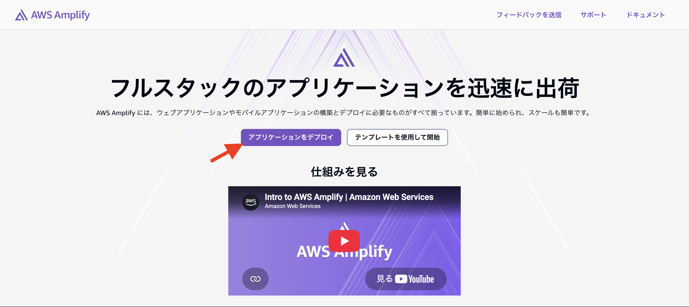
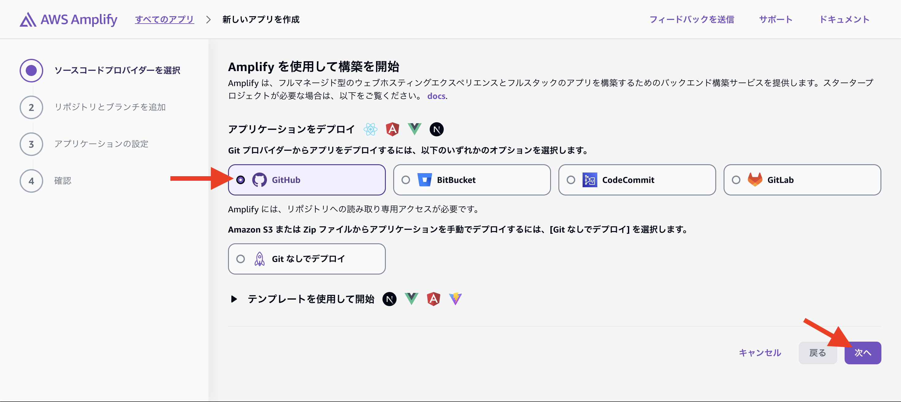
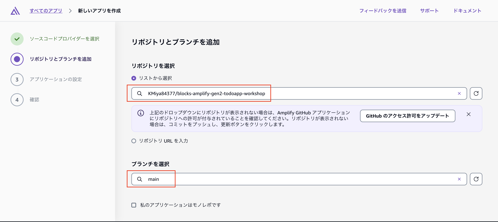
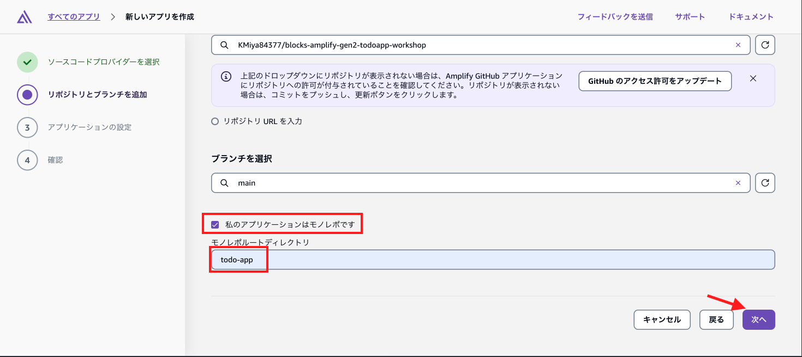
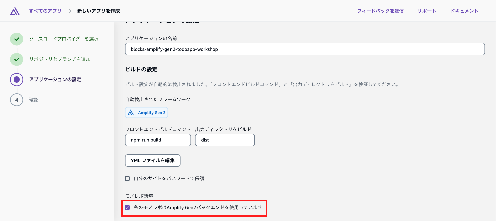
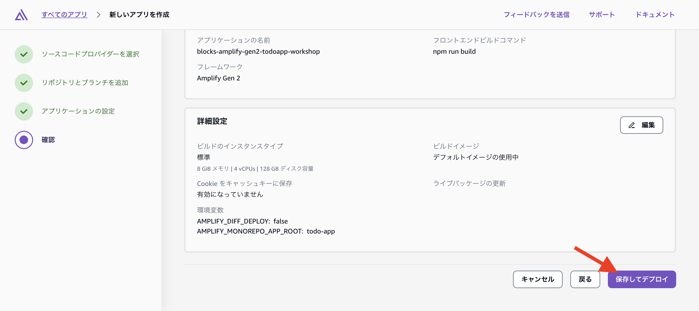

# ホスティング by AWS Amplify

AWS Amplify Hostingを使用して、TodoアプリをAWS上でホスティングします。

> **AWSアカウントの準備ができていない場合**
> AWS Blocksはローカル環境だけで開発が完結する仕組みなので、AWSアカウントが無くても3章までの内容はすべて動作します。
> AWSアカウントの準備ができていない方は、本章はスキップして構いません。

> **デプロイ後は課金が発生します**
> デプロイ後のAIアシスタントは、`local`(Bedrock APIキー)ではなく`deployed: BedrockModels.BALANCED`(Claude Sonnet 4.6、IAMロールで認証)を呼び出します。Amazon Bedrockの実際の呼び出しとして課金対象になります。

## Sandboxへのデプロイ

### ビルドコマンドの確認

型エラーが発生しないか、確認しておきましょう。

```shell
cd todo-app
npx tsc -b
```

エラーがあれば修正し、忘れずにコミットしておきましょう。

### AWSへのログイン

ここまでは`npm run blocks:dev`のローカルモックだけで進めてきました。
ここで初めてAWSへのログインが必要になります。

`aws login` コマンドを利用します。詳細な情報は[公式ドキュメント](https://docs.aws.amazon.com/ja_jp/signin/latest/userguide/command-line-sign-in.html#command-line-sign-in-local-development)をご覧ください。

#### マネージメントコンソールへのログイン

まず、AWS マネジメントコンソールにサインインしてください。

[AWS マネジメントコンソール リンク](https://console.aws.amazon.com/console/home/?nc2=h_si&src=header-signin)

リージョンをバージニア北部（us-east-1）に切り替えてください。

> **Admin相当権限を推奨**
> スムーズな進行のためには、Admin 相当権限でサインインすることをお勧めします。

#### CLI のログイン

次に、CLI のログインを実行します。

```shell
aws login --remote
> AWS Region [us-east-1]: # そのまま Enter
```

URL が表示されるのでクリックし、verification code を取得します。

verification code を CLI に入力し、認証を完了させます。

`Updated profile default to use arn:aws:iam::~ credentials.` と表示されれば完了です。

ログイン完了を確認します。自身のアカウントが表示されればOKです。
```shell
aws sts get-caller-identity
```

> **MFA必須アカウントの制約**
> 本ワークショップにおいて、MFA 必須のアカウントでは `aws login` コマンドで完遂できない可能性があります。
>
> その場合は別の方法でクレデンシャルの設定を実施してください。

### CDK Bootstrap

Amplify Gen2 は裏側で CDK を利用します。

CDK を初めて利用する AWS 環境・リージョンでは CDK Bootstrap という処理が必要です。

[CDK Bootstrap とは？](https://docs.aws.amazon.com/ja_jp/cdk/v2/guide/bootstrapping-env.html)

まだの環境であれば、[AWS マネージメントコンソール](https://us-east-1.console.aws.amazon.com/amplify/create/bootstrap?region=us-east-1)にアクセスして Bootstrap を実行してください。

> **リージョンごとにBootstrapが必要**
> 実行するリージョンごとに Bootstrap を実行する必要があります。
>
> バージニア北部リージョンにて CDK を利用したことがない場合は、他のリージョンで作業した実績があったとしても、本作業を実施する必要があります。

5 分程度かかりますので、お待ちください。

`CDKToolkit は us-east-1 リージョンですでに正常にセットアップされています。` と表示されていれば完了です。

### Sandboxへのデプロイ確認

ここで一度、実際にAWSへデプロイして動作確認します。

```shell
npm run sandbox
```

`File written: amplify_outputs.json` と表示されれば完了です。

Sandboxに接続するため、`client.js`を作り直します。

```shell
# 新しいターミナルを起動
cd todo-app
npm run blocks:generate-client
```

新しいターミナルで`npm run dev`を起動し、`http://localhost:5173/`にアクセスしてください。

```shell
npm run dev
```

実際に画面を操作し、Sandbox環境（本物のAWSリソース）でもTodo追加・AIアシスタントとのチャットが動作することを確認してください。

> **モックデータとSandbox環境のデータは別**
> `npm run blocks:dev`のモックデータ（`.bb-data/`）と、Sandbox環境のデータは別物です。ユーザーもTodoも引き継がれません。

## AWS Amplify Hostingでのデプロイ

**作業目安：10分**

### ホスティングの設定

Amplify Hosting のマネジメントコンソールでデプロイ設定を行います。

1. [マネジメントコンソール](https://us-east-1.console.aws.amazon.com/amplify/apps)にアクセス
2. `アプリケーションをデプロイ` をクリック

3. Git プロバイダーとして GitHub を選択し、「次へ」をクリック

4. 別ウィンドウが立ち上がるので、`Authorize AWS Amplify (us-east-1)` をクリック
5. GitHub の個人組織を選択し、`Only select repositories` で作成したリポジトリを選択して「Install」をクリック
6. 「リポジトリとブランチを追加」で作成したリポジトリを選択し、「main」ブランチが選択されたことを確認

7. `私のアプリケーションはモノレポです` にチェックを入れ、モノレポルートディレクトリに「todo-app」と入力し、「次へ」をクリック

8. アプリケーションの設定の `私のモノレポは Amplify Gen2 バックエンドを使用しています` にチェックを入れ、それ以外はそのまま「次へ」をクリック

9. 「デプロイ」をクリック


`デプロイ済み` と表示されれば完了です。
「ドメイン」と表示されている下の URL にアクセスして、実装した Todo アプリが表示されれば完成です。

> **Sandbox環境とは別のアプリケーション**
> ユーザーや作成したデータは引き継がれませんので、ご注意ください。

### amplify.yml について

`amplify.yml` は、Amplify Hosting での[ビルドとデプロイの設定を定義するファイル](https://docs.aws.amazon.com/ja_jp/amplify/latest/userguide/yml-specification-syntax.html)です。

このワークショップでは、リポジトリのルートに`amplify.yml`を配置しているため、Amplify Hosting が自動的にこの設定を読み込み、簡単にデプロイできるようになっています。

```yaml
version: 1
applications:
  - backend:
      phases:
        build:
          commands:
            - export NODE_OPTIONS="--conditions=cdk"
            - npx ampx pipeline-deploy --branch $AWS_BRANCH --app-id $AWS_APP_ID
    frontend:
      phases:
        build:
          commands:
            - npm run build
      artifacts:
        baseDirectory: dist
        files:
          - '**/*'
      cache:
        paths:
          - node_modules/**/*
    appRoot: todo-app
```

`backend`フェーズの`npx ampx pipeline-deploy`が、`todo-app/amplify/backend.ts`経由でAmplify・Blocks両方のリソースをまとめてデプロイします（本ワークショップではAmplify・Blocksの両方が同じCDK Appの中にあるため）。

ここまで確認できたら、次のステップ（[docs/5_おまけ Todo一覧のリアルタイム自動更新.md](5_おまけ%20Todo一覧のリアルタイム自動更新.md)）に進んでください。
